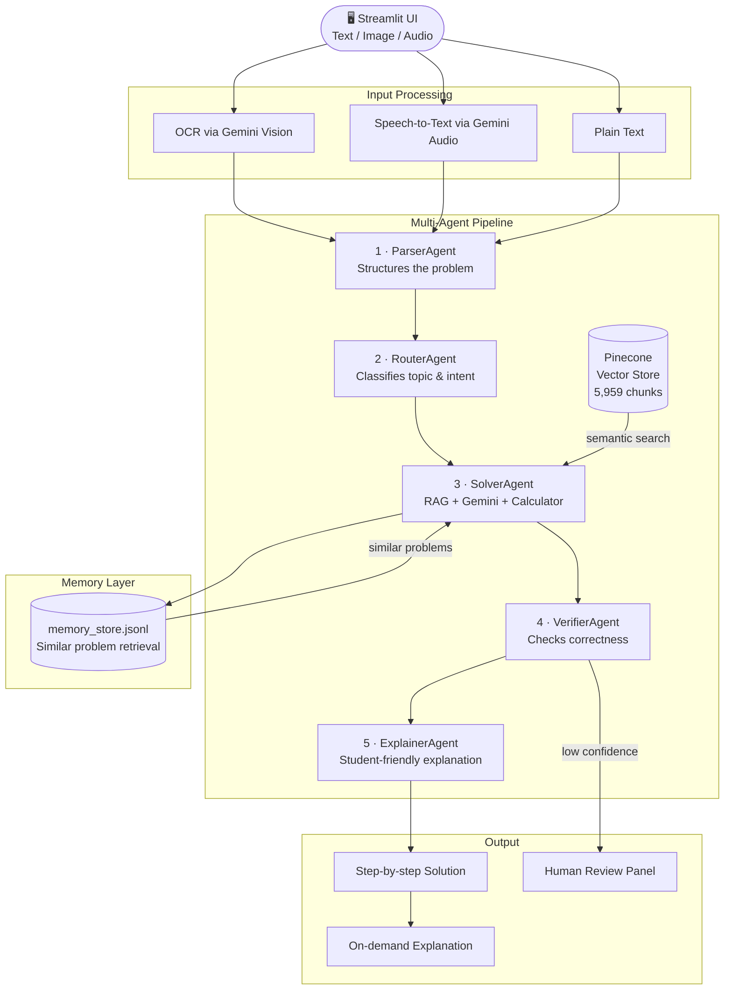

# ∑ Math Mentor — AI-Powered JEE Math Tutor

A multi-agent RAG system that solves, verifies, and explains JEE-level mathematics problems using Google Gemini and Pinecone vector search.

[](https://mathmentor.streamlit.app)

---

## 📐 Architecture



---

## 🚀 Quick Start

### 1. Clone the repo

```bash
git clone https://github.com/Subhhankar/Math_Mentor.git
cd Math_Mentor
```

### 2. Create and activate virtual environment

```bash
python -m venv math_env

# Windows
math_env\Scripts\activate

# macOS / Linux
source math_env/bin/activate
```

### 3. Install dependencies

```bash
pip install -r requirements.txt
```

### 4. Set up environment variables

```bash
cp .env.example .env
# Edit .env and add your API keys
```

### 5. Run the app

```bash
streamlit run app.py
```

---

## 🔑 Environment Variables

| Variable | Description | Where to get it |
|---|---|---|
| `GOOGLE_API_KEY` | Gemini API key (Flash 2.5) | [Google AI Studio](https://aistudio.google.com) |
| `PINECONE_API_KEY` | Pinecone vector DB key | [Pinecone Console](https://app.pinecone.io) |

---

## 📁 Project Structure

```
Math_Mentor/
├── app.py                   # Streamlit UI — main entry point
├── parser_agent.py          # Parses and structures raw input
├── intent_router_agent.py   # Classifies topic, routes to tools
├── solver_agent.py          # RAG + Gemini solver + calculator
├── verifier_agent.py        # Verifies solution correctness
├── explainer_agent.py       # Generates student-friendly explanation
├── vector_store.py          # Pinecone retriever setup
├── chunker.py               # PDF chunking + embeddings (ingestion only)
├── ingest.py                # One-time PDF ingestion script
├── memory.py                # Persistent memory & similar problem retrieval
├── hitl.py                  # Human-in-the-loop review system
├── requirements.txt
├── .env.example
├── .python-version          # Pins Python 3.11 for Streamlit Cloud
└── .streamlit/
    └── config.toml          # Theme and server settings
```

---

## 🧠 How It Works

### Multi-Agent Pipeline

Each user question passes through 5 agents in sequence:

1. **ParserAgent** — Converts raw text/OCR/audio into a structured problem dict with topic, variables, and constraints
2. **RouterAgent** — Classifies the topic (algebra, calculus, probability, linear algebra) and decides if a calculator is needed
3. **SolverAgent** — Retrieves relevant chunks from Pinecone, injects similar solved problems from memory, calls Gemini with full context, and runs a safe Python calculator for numerical steps
4. **VerifierAgent** — Independently checks correctness, units/domain validity, and edge cases
5. **ExplainerAgent** — Produces a student-friendly walkthrough with concept intro, tips, common mistakes, and follow-up problems

### RAG Setup

- **Source data:** JEE mathematics PDFs (643 pages → 5,959 chunks)
- **Embeddings:** `sentence-transformers/all-MiniLM-L6-v2` (dim=384)
- **Vector store:** Pinecone (serverless)
- **Retrieval:** Top-3 semantically similar chunks injected into solver prompt

### Memory Layer

After every solved problem, a record is saved to `memory_store.jsonl`. Before solving, the 3 most similar past problems are retrieved and injected into the solver prompt as additional context. Similarity is computed using the same sentence-transformer embeddings.

### Input Modes

| Mode | How it works |
|---|---|
| **Text** | Direct input |
| **Image** | Gemini Vision extracts math from photo/screenshot |
| **Audio** | Live mic recording → Gemini Audio transcription |

---

## ☁️ Streamlit Cloud Deployment

1. Fork this repo
2. Go to [share.streamlit.io](https://share.streamlit.io) → New app
3. Select your fork, branch `main`, file `app.py`
4. In **Settings → Secrets**, add:

```toml
GOOGLE_API_KEY = "your-key"
PINECONE_API_KEY = "your-key"
```

5. Deploy — the app will be live in ~3 minutes

> **Note:** `ingest.py` is a one-time script and does not run on deployment. The Pinecone index is already populated and accessed at runtime via API.

---

## ⚠️ Important Notes

- **Do not re-run `ingest.py`** — it will re-upload all PDFs and duplicate the Pinecone index
- **`memory_store.jsonl`** is created at runtime and is not committed to the repo
- Gemini free tier allows ~20 requests/day with `gemini-2.5-flash`. Each solve uses 4–5 calls. Consider upgrading to paid for production use.

---

## 🛠 Tech Stack

| Layer | Technology |
|---|---|
| UI | Streamlit |
| LLM | Google Gemini 2.5 Flash |
| Embeddings | sentence-transformers/all-MiniLM-L6-v2 |
| Vector DB | Pinecone (serverless) |
| Agent Framework | LangChain |
| Memory | JSONL flat file + semantic retrieval |
| Audio | streamlit-mic-recorder + Gemini Audio API |
| OCR | Gemini Vision |

---

## 📄 License

MIT