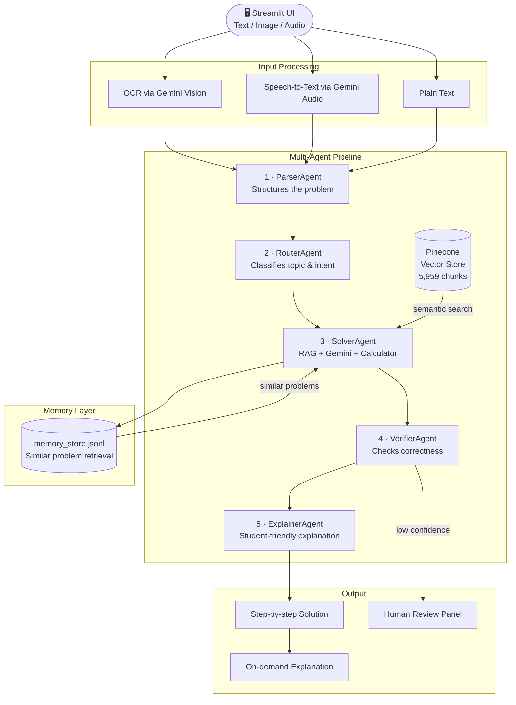

# Math Mentor — Architecture Diagram

```mermaid
flowchart TD
    UI([🖥 Streamlit UI\nText / Image / Audio])

    subgraph INPUT["Input Processing"]
        OCR[OCR via Gemini Vision]
        ASR[Speech-to-Text via Gemini Audio]
        TXT[Plain Text]
    end

    subgraph PIPELINE["Multi-Agent Pipeline"]
        direction TB
        PA[1 · ParserAgent\nStructures the problem]
        RA[2 · RouterAgent\nClassifies topic & intent]
        VS[(Pinecone\nVector Store\n5,959 chunks)]
        SA[3 · SolverAgent\nRAG + Gemini + Calculator]
        VA[4 · VerifierAgent\nChecks correctness]
        EA[5 · ExplainerAgent\nStudent-friendly explanation]
    end

    subgraph MEMORY["Memory Layer"]
        MEM[(memory_store.jsonl\nSimilar problem retrieval)]
    end

    subgraph OUTPUT["Output"]
        SOL[Step-by-step Solution]
        EXP[On-demand Explanation]
        HITL[Human Review Panel]
    end

    UI --> OCR & ASR & TXT
    OCR & ASR & TXT --> PA
    PA --> RA
    RA --> SA
    VS -- semantic search --> SA
    MEM -- similar problems --> SA
    SA --> VA
    VA --> EA
    EA --> SOL
    SOL --> EXP
    VA -- low confidence --> HITL
    SA --> MEM
```